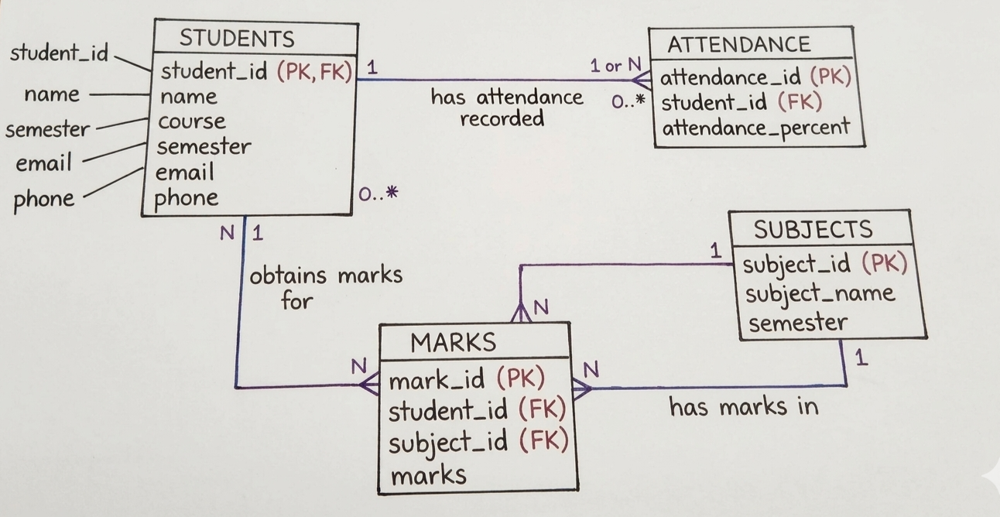

# Student Database Management System

This is a simple project using PostgreSQL and Python.
It stores student details and marks.

Folders:
- database/ : backups
- sql/ : SQL scripts
- scripts/ : Python scripts

## ER Diagram

