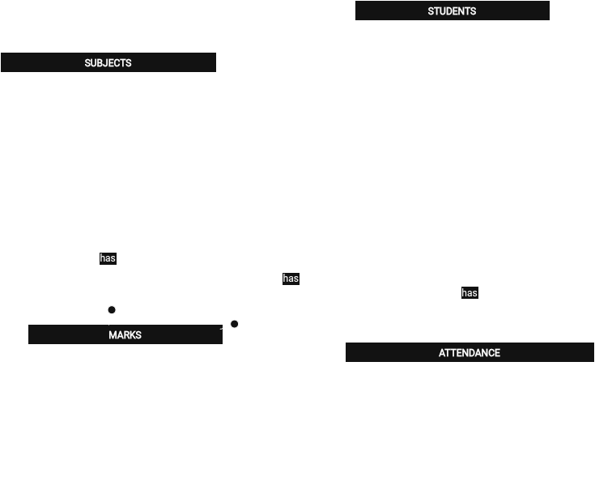

# Student Database Management System (PostgreSQL + Python)

## Description
This is a professional backend project using PostgreSQL and Python.  
It manages student information, subjects, marks, and attendance with proper queries and reports.  
The system can generate average marks, toppers per semester, students below threshold marks, and attendance reports.

## Features
- PostgreSQL database with `students`, `subjects`, `marks`, and `attendance` tables
- Python script (`db_operations.py`) to connect and query the database
- Calculate average marks per student
- Identify toppers for each semester
- List students below 75% average marks (threshold)
- Attendance report generation
- Backup and restore functionality
- Professional folder structure for organization

## Folder Structure

student-dbms-postgresql/
│
├── README.md                  # Project description, instructions, and features
├── requirements.txt           # Python dependencies (e.g., psycopg2)
│
├── database/
│   └── studentdb_backup.dump  # PostgreSQL database backup file
│
├── scripts/
│   └── db_operations.py       # Python script for all DB operations
│
├── sql/
│   ├── schema.sql             # SQL script to create tables (students, subjects, marks, attendance)
│   ├── sample_data.sql        # SQL script with sample data

## ER Diagram

